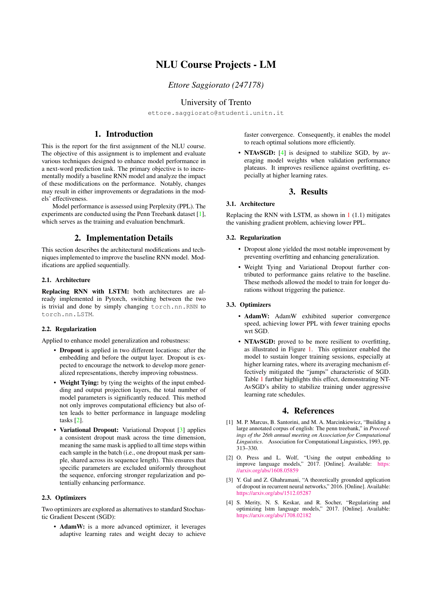
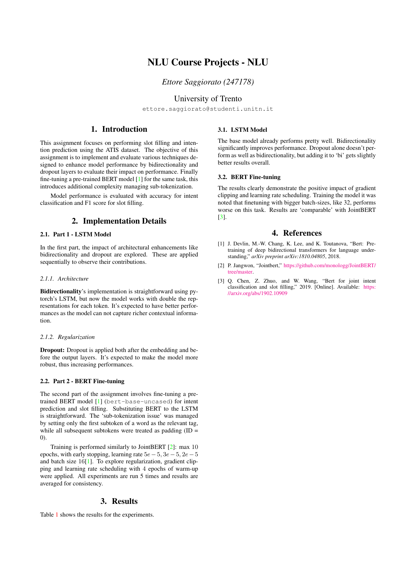
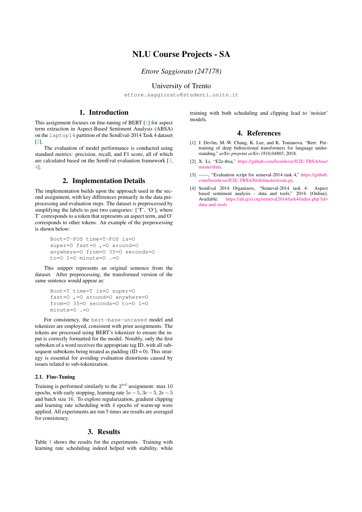

## LM - Language Modeling

The objective is to implement various techniques that can enhance the performance of a simple language model for next-word prediction and to understand how each of these techniques influences the model. Experiment with the model architecture, substituting the RNN with an LSTM block, using different optimizers, and apply different regularization techniques: Dropout, Weight Tying, Variational Dropout, and Non-Monotonically Triggered Average SGD.

- **Dataset**: PennTreeBank.
- **Metrics**: Perplxity.

## NLU - Natural Language Understanding

The objective for this assignment is to jointly perform slot filling and intent prediction on the ATIS dataset. Intent prediction requires the model to classify the whole sequence to a predefined set of possible user intentions. Slot filling consists of identifying and classifying the relevant entities in the sequence, used to parameterize the user intent. For the first part, we are tasked with implementing a functioning system using an LSTM backbone for the word token representations. For the second part, we are tasked with finetuning a pre-trained transformer BERT encoder to do the same task. The detail that needs more attention is about managing sub-tokenization.

- **Dataset**: Atis.
- **Metrics**: Accuracy (intention classification), F1 (slot filling).

## SA - Sentiment Analysis

Fine-tune BERT for the Aspect-based Sentiment Analysis task regarding the extraction of the aspect terms only. This assignment is very similar to NLU, the main difference is how the labels are managed (all of them are either `O` or `T`), and adapting [SemEval](https://github.com/lixin4ever/E2E-TBSA/blob/master/evals.py) for this task.

- **Dataset**: SemEval2014, laptop, task 4.
- **Metrics**: F1, Precision and Recall.

  

    
    
Click to download Report LM

  

  

    
    
Click to download Report NLU

  

  

    
    
Click to download Report SA

  

